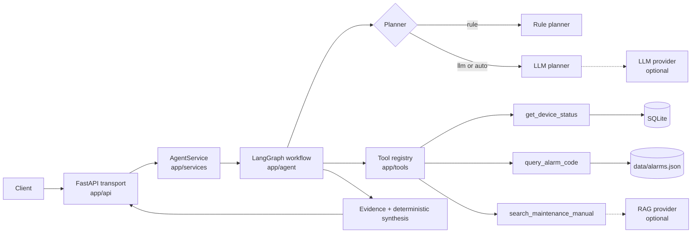

# Industrial Maintenance Agent

## Overview

An HTTP service for industrial equipment maintenance assistance. It answers
questions about registered equipment by calling deterministic tools, retrieving
maintenance manual evidence, and rendering an answer from what those tools
actually returned. The planner chooses which tools to call. The answer text is
assembled from evidence rather than generated.

### The problem

A maintenance question normally needs three things at once. It needs the live
state of one specific machine, the meaning and remedy of an alarm code, and the
matching page of the equipment manual. A general-purpose chat assistant can
produce fluent text about all three without being correct about any of them. A
wrong torque figure or a wrong bearing clearance is a safety problem rather than a
formatting problem. What is missing is not fluency. It is a bounded system whose
answer can be traced back to a tool result or a retrieved document.

### What the service does

`POST /agent/invoke` runs a fixed five-stage workflow: `route_query` classifies
the request, `plan_actions` selects tools and arguments, `execute_tools` runs
them, `retrieve_context` pulls manual evidence, and `synthesize` renders the
answer. Three deterministic tools sit behind a shared registry, covering device
status from a SQLAlchemy model, alarm codes from a local catalog, and maintenance
manual search against an external RAG engine.

### Why this is not a chatbot

1. **The LLM, when enabled, cannot write the answer.** It selects tools and
   arguments and nothing else. It never sees retrieval results while planning and
   never composes the response text. With `PLANNER_MODE=rule`, the default, there
   is no LLM in the process at any stage.
2. **The answer is rendered from evidence.** Every claim in the response comes
   from a tool result or a retrieved document, and the same evidence is returned
   alongside it in the `evidence` field.
3. **Both planners emit the same validated plan.** The rule planner and the LLM
   planner produce the same `AgentPlan` model, checked against the same registry
   and the same argument models, so the executor cannot tell them apart. That
   equivalence is what makes the comparison between them meaningful.
4. **Failure is explicit.** A tool that cannot run reports `found=false` with an
   `error`. A plan that fails validation raises a coded `PlannerError`. A missing
   provider produces `LLM_PROVIDER_ERROR` naming the missing variable. Nothing is
   silently downgraded and nothing is guessed.
5. **The capability claim is measured.** The rule planner and a real external LLM
   planner are both scored against a 49-case hand-authored answer key, and every
   figure below comes from a recorded run under `evaluation/reports/`.

### Headline results

Rule planner, frozen, 49 cases, planner only:

| Metric | Value |
| ------ | ----- |
| Intent accuracy | 0.9756 |
| Tool selection exact match | 0.7959 |
| Task success rate | 0.7959 |
| Argument accuracy | 1.0000 |
| Mean planning latency | 0.2103 ms |

LLM planner (`openai_compatible`, `deepseek-flash`), mean of three independent
49-case runs:

| Metric | Value |
| ------ | ----- |
| Intent accuracy | 0.96748 |
| Tool selection exact match | 0.80272 |
| Task success rate | 0.78231 |
| Tool precision | 0.94805 |
| Tool recall | 0.90547 |
| Unnecessary tool call rate | 0.05195 |
| Mean planning latency | 1410.44 ms |
| Tokens per case | 1094.40 |

These are three runs, not a confidence interval, and the spread between them is
published in full under [Evaluation and benchmarks](#evaluation-and-benchmarks).
The dataset is a hand-authored reference, so it bounds neither planner in general.

### Release history

V0.4 wired the Industrial Knowledge RAG repository in as a retrieval tool: a fully
deterministic `route_query -> plan_actions -> execute_tools -> retrieve_context ->
synthesize` pipeline backed by the registry, with a rule-based parser and no LLM
at any stage.

V0.4.2 exposed that pipeline over HTTP through `POST /agent/invoke`, behind an
`app/api` transport layer and an `AgentService` that owns request correlation,
latency measurement, state translation and logging. The workflow is unchanged.

V0.5 added an optional LLM planner alongside the frozen rule planner. The planner
decides which tools to call and with which arguments. The default configuration,
`PLANNER_MODE=rule`, leaves the earlier behaviour untouched.

V0.6 added an agent evaluation framework, kept separate from `tests/` on purpose.
A software test asserts that the code does what the specification says. It cannot
tell you how often the plan is the right plan. The framework measures agent
capability against a hand-authored answer key, and the baseline is produced by
running the real planner over the real dataset. No stub is scored, and no number
is reported that was not measured.

V0.7 extended the framework to a real LLM planner benchmark: a Rule versus LLM
comparison that refuses to approximate, a latency distribution with a documented
p95 convention, and a gate that stops a stub from standing in for a provider.
V0.7.1 hardened it with a three-run stability study, provider-reported token
usage, and a measured before-and-after fix to the end-to-end retrieval path.

V0.8 is the public release candidate: repository audit, container packaging, a
documented architecture, and version alignment across the tree. No planner
behaviour and no benchmark number changed in this version.

## Stack

| Concern       | Choice                                        |
| ------------- | --------------------------------------------- |
| Runtime       | Python 3.11                                   |
| Web service   | FastAPI + Uvicorn                             |
| Agent workflow| LangGraph                                     |
| Data models   | Pydantic v2                                   |
| Persistence   | SQLAlchemy 2.0 (SQLite by default, Alembic ready) |
| RAG client    | `httpx` (HTTP provider) or in-process import (local provider) |
| LLM client    | `httpx`, optional and configured off by default |
| Testing       | pytest + httpx TestClient                     |
| Agent eval    | `evaluation/`: hand-authored dataset + metric harness |


## Architecture

The service is layered, and the layering is held by dependency direction rather
than by convention. A request enters at the transport layer, is handed to the
service layer, and is executed by a LangGraph workflow. The planner sits between
parsing and execution. The tools sit behind a registry, and the two optional
external dependencies, the LLM provider and the RAG provider, sit behind their
own interfaces so neither can reach into the workflow.



Dotted edges are inactive by default. The LLM provider needs `PLANNER_MODE=llm` or
`auto` plus credentials, and the RAG provider needs `RAG_PROVIDER` to be
configured.

The full set of diagrams, including the request lifecycle, the planner decision
path, the evidence flow and the module boundary table, is in
[docs/architecture.md](docs/architecture.md).

Three design decisions are worth stating explicitly.

**Planning is single-shot.** There is no re-planning loop after tool execution. A
plan that names an unavailable tool is reported as a failure rather than retried,
because a retry would make the plan depend on execution results and the
planner-only benchmark would stop being a measurement of planning.

**The answer is not model-written.** Synthesis renders text from results. This is
what allows the `evidence` field to be an actual provenance record rather than a
list of documents that were merely retrieved.

**The optional dependencies are genuinely optional.** The core service runs with
no provider, no credential and no RAG checkout. A deferred import keeps the RAG
engine out of the process until the first manual search, so an unused integration
costs nothing at startup.

## Project layout

```
industrial-maintenance-agent/
├── app/
│   ├── __init__.py
│   ├── config.py            # Settings loaded from env / .env
│   ├── logging_config.py    # Logger configuration for the app namespace
│   ├── main.py              # FastAPI composition: routers + error handlers
│   ├── api/                 # HTTP layer (transport only, no workflow)
│   │   ├── errors.py        # Structured failure handler
│   │   ├── routes/
│   │   │   ├── agent.py     # POST /agent/invoke
│   │   │   └── meta.py      # GET / and GET /health
│   │   └── schemas/
│   │       └── agent.py     # Invoke request / response / error models
│   ├── agent/
│   │   ├── state.py         # MaintenanceState (LangGraph state)
│   │   ├── parser.py        # Rule-based natural language query parser
│   │   ├── graph.py         # Planner / executor / context / synthesis graph
│   │   └── planners/        # Planner layer (V0.5)
│   │       ├── schema.py        # AgentPlan / ToolCallPlan + error taxonomy
│   │       ├── tool_schemas.py  # JSON Schema generated from the input models
│   │       ├── llm.py           # LLM planner: prompt, call, validation
│   │       └── dispatch.py      # rule / llm / auto selection + bookkeeping
│   ├── integrations/
│   │   ├── llm/             # Optional OpenAI-compatible provider (V0.5)
│   │   │   ├── models.py    # LLMMessage / request / result, vendor-neutral
│   │   │   ├── base.py      # LLMProvider interface + error taxonomy
│   │   │   ├── openai_compatible.py  # httpx transport, no vendor SDK
│   │   │   └── factory.py   # Config-driven selection + configuration gate
│   │   └── rag/
│   │       ├── models.py        # RAGSearchHit / RAGSearchResponse
│   │       ├── base.py          # RAGProvider interface + RAGProviderError
│   │       ├── local_provider.py # In-process retrieval (LLM-free)
│   │       ├── http_provider.py  # POST /ask client
│   │       └── factory.py        # Config-driven provider selection
│   ├── schemas/
│   │   ├── maintenance.py   # Pydantic request / response models
│   │   └── evidence.py      # Evidence model (tool + document sources)
│   ├── services/
│   │   ├── __init__.py      # Lazy exports (breaks the agent/services cycle)
│   │   ├── agent_service.py # Invocation: correlation, timing, state mapping
│   │   └── device_catalog.py # Device id + alias resolution
│   ├── database/
│   │   ├── base.py          # Declarative base
│   │   ├── models.py        # Device ORM model
│   │   ├── session.py       # Engine + session factory
│   │   ├── init_db.py       # Schema creation + seed helpers / CLI
│   │   └── __main__.py      # `python -m app.database` entry point
│   └── tools/
│       ├── names.py         # Canonical tool names (ToolName enum)
│       ├── registry.py      # Tool registry, carries each tool's input model
│       ├── arguments.py     # Strict argument validation, shared by both layers
│       ├── device_tool.py   # get_device_status (Device ORM backed)
│       ├── alarm_tool.py    # query_alarm_code (data/alarms.json backed)
│       └── maintenance_manual_tool.py  # search_maintenance_manual (RAG backed)
├── evaluation/                  # The Agent evaluation framework, the only one
│   ├── dataset.json             # 49 hand-authored cases + ground-truth policy
│   ├── dataset.py               # Dataset models and answer-key validation
│   ├── metrics.py               # Metric primitives; a zero denominator is null
│   ├── evaluator.py             # Per-case scoring and aggregation
│   ├── runner.py                # CLI: planner-only / end-to-end, LLM gate
│   ├── comparison.py            # CLI: rule versus LLM delta, refuses to approximate
│   └── reports/                 # Generated baselines and failure records
├── tests/
│   ├── test_health.py           # Smoke tests
│   ├── test_database.py         # Device model + init_db tests
│   ├── test_tools.py            # Device tool, alarm tool, registry
│   ├── test_parser.py           # Parser + route_query / plan_actions tests
│   ├── test_pipeline.py         # Planner -> executor -> synthesis tests
│   ├── test_rag_provider.py     # Provider contract tests
│   ├── test_maintenance_manual_tool.py  # RAG tool contract tests
│   ├── test_rag_pipeline.py     # Graph order, evidence mapping, e2e
│   ├── test_rag_score_semantics.py      # Score labelling and direction
│   ├── test_api.py              # HTTP contract, validation, failure handling
│   ├── fake_llm.py              # LLM provider double, no network
│   ├── test_llm_provider.py     # Provider envelope, errors, credential safety
│   ├── test_llm_planner.py      # Prompt, plan validation, error taxonomy
│   ├── test_planner_modes.py    # rule / llm / auto, executor, API surface
│   ├── test_evaluation.py       # Dataset, metrics, OOD safety, CLI, LLM gate
│   └── test_planner_comparison.py  # rule vs LLM delta, refusals, hash lock
├── data/
│   ├── devices.json         # Device seed data
│   ├── alarms.json          # Alarm code catalog
│   └── (industrial_maintenance.db generated locally, gitignored)
├── scripts/
│   ├── rag_build_knowledge_base.py  # Build the RAG light index from a corpus
│   ├── rag_retrieval_probe.py       # Run retrieval-only queries, no LLM
│   └── llm_planner_probe.py         # Real LLM planner smoke gate, no fabrication
├── docs/
│   └── architecture.md      # Component map, request lifecycle, planner path
├── requirements.txt             # Runtime dependencies
├── requirements-dev.txt         # Dev / test dependencies
├── requirements-rag-local.txt   # Optional deps for RAG_PROVIDER=local
├── pyproject.toml           # Project metadata + tool config
├── Dockerfile               # Unprivileged image, no secret baked in
├── .dockerignore            # Keeps .env, caches and working state out of the context
├── docker-compose.yml       # Single service, named volume, health check
├── .env.example             # Environment template, placeholders only
└── README.md
```


## Getting started

Create and activate a Python 3.11 virtual environment, then install
dependencies:

```bash
python3.11 -m venv .venv
# Windows (Git Bash)
source .venv/Scripts/activate
# macOS / Linux
# source .venv/bin/activate

pip install -r requirements-dev.txt
```

## Configuration

All configuration is environment based, read through `pydantic-settings`. Start
from the template:

```bash
cp .env.example .env
```

`.env` is gitignored, and the ignore rule covers every `.env.*` variant except the
template, so a stray `.env.txt` or `.env.backup` cannot be committed.
`.env.example` contains placeholders only.

### Application

| Variable | Default | Purpose |
| -------- | ------- | ------- |
| `APP_NAME` | `Industrial Maintenance Agent` | FastAPI title and `GET /` identity |
| `APP_VERSION` | package version | Reported by `GET /` and `/openapi.json` |
| `ENVIRONMENT` | `development` | Deployment label |
| `DEBUG` | `true` | Uvicorn reload |
| `LOG_LEVEL` | `INFO` | Verbosity for the `app` logger namespace; an unknown value fails at startup |
| `HOST` | `0.0.0.0` | Bind address for the development entry point |
| `PORT` | `8000` | Bind port for the development entry point |
| `DATABASE_URL` | `sqlite:///./data/industrial_maintenance.db` | SQLAlchemy URL |
| `AUTO_CREATE_TABLES` | `true` | Create missing tables on startup |

### Planner

| Variable | Default | Purpose |
| -------- | ------- | ------- |
| `PLANNER_MODE` | `rule` | `rule`, `llm` or `auto`. See [planner modes](#modes) |

With `PLANNER_MODE=rule` the four `LLM_*` variables below are unused and the
pipeline is entirely LLM-free. Nothing needs to be unset for that to hold.

### LLM provider

Required only when `PLANNER_MODE` is `llm` or `auto`.

| Variable | Default | Purpose |
| -------- | ------- | ------- |
| `LLM_BASE_URL` | empty | API root of an OpenAI-compatible endpoint, for example `https://host/v1`. No host is assumed |
| `LLM_API_KEY` | empty | Secret, held as `SecretStr` and read only when the request header is built |
| `LLM_MODEL` | empty | Model identifier sent in the request body |
| `LLM_TIMEOUT_SECONDS` | `30` | Upper bound on one provider call |
| `LLM_TEMPERATURE` | `0` | Sampling temperature |

No vendor SDK is used, so any endpoint that speaks OpenAI-style chat completions
works. An incomplete configuration surfaces as `LLM_PROVIDER_ERROR` naming the
missing variable rather than as a request to an invented endpoint.

### RAG integration

| Variable | Default | Purpose |
| -------- | ------- | ------- |
| `RAG_PROVIDER` | `local` | `local` runs the retrieval engine in-process; `http` calls a RAG service |
| `RAG_REPO_ROOT` | empty | Required for `local`. Path to a RAG checkout. No default path is assumed |
| `RAG_BACKEND` | `light` | `light` (`light_rag_core`) or `full` (`rag_core`) |
| `RAG_KNOWLEDGE_BASE_ID` | `default` | Knowledge base identifier registered inside the RAG service |
| `RAG_RETRIEVAL_MODE` | `hybrid` | `lexical`, `vector` or `hybrid` |
| `RAG_TOP_K` | `4` | Default hit limit for `search_maintenance_manual` |
| `RAG_BASE_URL` | empty | Required for `http`. No default host or port is assumed |
| `RAG_TIMEOUT_SECONDS` | `10` | Upper bound on one RAG call |
| `RAG_HTTP_MODEL_PROVIDER` | `DeepSeek` | Passed to the RAG service. The agent discards its generated answer and keeps the retrieval evidence only |

Nothing about the host, port, timeout, knowledge base id or repository path is
hardcoded. A misconfigured provider raises at construction time, and the tool
surfaces it through `error` rather than returning an empty result.

## Running the service

```bash
uvicorn app.main:app --reload --port 8000
```

Available endpoints:

| Method | Path            | Purpose                          |
| ------ | --------------- | -------------------------------- |
| GET    | `/`             | Service identity probe           |
| GET    | `/health`       | Liveness / readiness probe       |
| POST   | `/agent/invoke` | Run the maintenance agent        |

Interactive API docs are served at `/docs` and `/redoc`; the raw schema is at
`/openapi.json`.

> The RAG service documents port `8000` as well. When both services run on the
> same host, change one of them; the agent never assumes a port.

### Docker

The image runs the deterministic planner by default, so it needs no credential.
It runs as an unprivileged user and writes SQLite to a named volume.

```bash
docker build -t industrial-maintenance-agent:0.8.0 .
docker run --rm -p 8000:8000 industrial-maintenance-agent:0.8.0
```

With Compose:

```bash
docker compose up --build
```

The container exposes port `8000`; `GET /health` is used as the health check, so
an unhealthy container is one where the application itself is not answering.

Two properties of the image are deliberate.

No secret is baked in. `.dockerignore` excludes `.env` and every `.env.*` variant,
and the Dockerfile copies neither the template nor any local configuration. When
the optional LLM planner is enabled, the key is supplied at run time through the
environment.

The RAG integration stays opt-in. `RAG_PROVIDER=local` needs a RAG checkout, so
`docker-compose.yml` ships the mount line commented out and read-only. Uncomment
it, point `RAG_REPO_ROOT` at the mount point, and the container still never writes
to it:

```yaml
volumes:
  - /path/to/industrial-knowledge-rag:/rag:ro
```

### Database

SQLite is the default backend. The `Device` ORM model lives in
`app/database/models.py` and exposes these fields: `id`, `device_id`,
`device_name`, `device_type`, `location`, `status`, `temperature`, `pressure`,
`rpm`, `alarm_code`, `last_maintenance_time`.

#### Initialize the database

```bash
# Create tables and seed data/devices.json
python -m app.database

# Drop existing tables, recreate them, then seed
python -m app.database --reset

# Create tables only
python -m app.database --no-seed
```

The same CLI is also available as `python -m app.database.init_db`.

Seeding upserts by `device_id`, so repeated runs are idempotent. The service
also creates missing tables on startup when `AUTO_CREATE_TABLES=true` (default).
The seed file `data/devices.json` ships with `PLC-001`, `PLC-002`, `Robot-001`
plus two additional devices.


## API

### `POST /agent/invoke`

Runs one agent invocation. With the default `PLANNER_MODE=rule` the run is fully
deterministic; with `llm` or `auto` the planning step calls a configured provider
and the answer remains deterministic and grounded. The endpoint is declared with
`def` rather than `async def` on purpose: the pipeline is synchronous, so
Starlette dispatches it to a worker thread instead of blocking the event loop. The
provider call is bounded by `LLM_TIMEOUT_SECONDS`, so a slow endpoint occupies a
worker thread for at most that long.

Request body:

| Field   | Type   | Required | Notes                                        |
| ------- | ------ | -------- | -------------------------------------------- |
| `query` | string | yes      | 1 to 2000 characters, stripped before use     |
| `debug` | bool   | no       | Defaults to `false`; adds the diagnostic block |

```bash
curl -s -X POST http://127.0.0.1:8000/agent/invoke \
  -H "Content-Type: application/json" \
  -d '{"query": "PowerFlex 520 drive F007 motor overload how to fix"}' \
  | python -m json.tool
```

Response body:

| Field          | Type            | Notes                                                     |
| -------------- | --------------- | --------------------------------------------------------- |
| `request_id`   | string          | Fresh uuid4 per invocation, also written to the log        |
| `query`        | string          | Echo of the normalized query                               |
| `intent`       | string \| null  | `alarm_diagnosis`, `maintenance_advice`, `device_status`, `unknown` |
| `equipment_id` | string \| null  | Resolved equipment identifier                              |
| `alarm_code`   | string \| null  | Resolved alarm code                                        |
| `tools_called` | list[string]    | Tools the executor actually ran, in execution order        |
| `planner_used` | string \| null  | Planner that produced the plan: `rule` or `llm`             |
| `planner_fallback` | bool        | `true` when an LLM plan was attempted and the rule planner ran instead |
| `answer`       | string          | Deterministic Chinese answer with the three fixed sections  |
| `evidence`     | list[Evidence]  | Citable facts; document evidence carries page and score     |
| `latency_ms`   | float           | Measured service latency in milliseconds                   |
| `debug_info`   | object \| null  | Present only when `debug=true`                             |

```json
{
  "request_id": "67640994-02df-4c08-a7d0-e7d202ae1094",
  "query": "PowerFlex 520 drive F007 motor overload how to fix",
  "intent": "maintenance_advice",
  "equipment_id": null,
  "alarm_code": null,
  "tools_called": ["search_maintenance_manual"],
  "planner_used": "rule",
  "planner_fallback": false,
  "answer": "【设备状态】\n本次未查询设备状态。\n\n【报警信息】\n本次未查询报警信息。\n\n【维护手册证据】\n命中 4 条片段（provider：local，检索模式：hybrid）。",
  "evidence": [
    {
      "source_type": "document",
      "source": "PowerFlex_520_User_Manual.pdf",
      "tool_name": "search_maintenance_manual",
      "content": "Fault Code F007 Motor Overload ...",
      "document": "PowerFlex_520_User_Manual.pdf",
      "page": 84,
      "score": 0.6743284463882446,
      "score_semantics": "vector_cosine_distance",
      "higher_is_better": false
    }
  ],
  "latency_ms": 4894.949,
  "debug_info": null
}
```

`tools_called` reports execution, not intention. The planner's `required_tools`
may name a tool the executor could not dispatch, and reporting the plan as
execution would overstate what happened. The plan is available through
`debug_info.required_tools` instead.

`planner_used` and `planner_fallback` describe which planner ran, not which one
was configured. In `auto` mode a fallback is visible without reading the log,
because a silently downgraded plan would look identical to a successful one.

When `debug=true`, `debug_info` carries:

| Field                     | Notes                                                        |
| ------------------------- | ------------------------------------------------------------ |
| `required_tools`          | Tools the planner scheduled                                  |
| `tool_status`             | Per-tool `found` flag and diagnostic                         |
| `internal_error`          | Pipeline-level diagnostic, such as an undispatched tool      |
| `planner_fallback_reason` | `<CODE>: <detail>` when the rule planner ran after an LLM attempt |

The debug block never contains the planner's system prompt, the raw completion or
an environment value. A model can echo its prompt, and the prompt carries the tool
schemas and the device vocabulary, so only curated fields are exposed.

### Validation

`query` is constrained to 1 to 2000 characters. A blank query, including a run
of spaces, is rejected rather than passed to the parser: `min_length=1` alone
would accept `"   "`. Rejections use the standard FastAPI 422 body and name the
offending field.

```json
{"detail":[{"type":"string_too_short","loc":["body","query"],"msg":"String should have at least 1 character","input":"","ctx":{"min_length":1}}]}
```

### Failures

A pipeline failure returns HTTP 500 with a structured body. The exception, its
message, its stack and the configuration never leave the process; the caller gets
a stable code and the `request_id` needed to find the matching server log line.

```json
{
  "request_id": "3de135b2-2b8f-455c-996d-92f7dfec99cb",
  "error": "agent_invocation_failed",
  "message": "Agent 执行失败，请稍后重试；如问题持续，请提供 request_id 以便排查。",
  "latency_ms": 11.796
}
```

Note the distinction: a knowledge base that is reachable but empty is not a
failure. The request succeeds, no document evidence is produced, and the answer
says the manual contains nothing on the query.

In `PLANNER_MODE=llm` a planning failure is a request failure and returns HTTP 500
with the planner's own code in `error` instead of `agent_invocation_failed`. The
five codes are `LLM_PROVIDER_ERROR`, `LLM_TIMEOUT`, `INVALID_PLANNER_OUTPUT`,
`UNKNOWN_TOOL` and `TOOL_ARGUMENT_VALIDATION_FAILED`. The body stays generic: no
prompt, no raw completion, no endpoint header and no credential.

```json
{
  "request_id": "9a1c6f2e-0c1b-4d2f-9f2a-5c0b7e4d1a33",
  "error": "LLM_TIMEOUT",
  "message": "Agent 执行失败，请稍后重试；如问题持续，请提供 request_id 以便排查。",
  "latency_ms": 30012.441
}
```

### Logging

One line per invocation, with a fixed field set:

```
2026-09-15 13:57:58,280 INFO app.services.agent_service agent_invoke request_id=<uuid> success=true latency_ms=13.544 planner=rule fallback=false tools_called=get_device_status query='PLC-001 现在什么状态'
2026-09-15 13:57:58,280 ERROR app.services.agent_service agent_invoke_failed request_id=<uuid> success=false latency_ms=11.796 error_type=OperationalError
```

The success line records which planner ran and whether it was a fallback, so a
downgrade is visible in the operational record. A fallback also logs a warning
from the dispatcher carrying the reason code, never the prompt.

`app/logging_config.py` attaches a stream handler to the `app` package logger,
called from `app/main.py`. Without it an unconfigured logger inherits the root
level `WARNING` and every `INFO` line is dropped, so a successful invocation
would leave no trace. The change stays inside the `app` namespace, leaving
third-party verbosity alone, and `propagate` remains `True` so a host root
handler still receives these records. Verbosity is set by `LOG_LEVEL`
(default `INFO`); an unknown value fails at startup.

The query is rendered with `%r`, so a query containing spaces, quotes or a
newline stays on one line and remains parseable.

The failing line records the exception's class name and nothing else. An
exception message can embed a provider URL, a header or a key fragment, so it is
deliberately not logged. Neither line records an environment value, a credential
or a traceback.

### Layering

`app/main.py` composes and nothing more. `app/api` holds transport models,
routers and error handling; it never imports the workflow. `app/services`
holds `AgentService`, which calls the graph, generates the request id, measures
latency and maps the final state onto the response schema. `app/agent` holds the
workflow, unaware that HTTP exists. The compiled graph is therefore reachable
through exactly one route.

### Demo examples

Both responses below were captured from a local run with `PLANNER_MODE=rule` and
no LLM provider configured, so the plan comes from the deterministic planner.
Nothing is retyped or hand-edited. `request_id` is per invocation and is left out
here, and `latency_ms` varies with the machine.

#### Example 1: Chinese device status question

```bash
curl -s -X POST http://127.0.0.1:8000/agent/invoke \
  -H 'Content-Type: application/json' \
  -d '{"query": "PLC-001 \u73b0\u5728\u4ec0\u4e48\u72b6\u6001\uff1f"}'
```

Response:

```json
{
  "query": "PLC-001 现在什么状态？",
  "intent": "device_status",
  "equipment_id": "PLC-001",
  "alarm_code": null,
  "tools_called": [
    "get_device_status"
  ],
  "planner_used": "rule",
  "planner_fallback": false,
  "answer": "【设备状态】\n设备编号与名称：PLC-001（包装线PLC）\n设备类型：PLC\n安装位置：车间A-包装线\n当前状态：running\n关键状态：温度 78.0，压力 0.62，转速 0.0\n报警码：F0045\n最近保养时间：2026-08-20T09:30:00\n\n【报警信息】\n本次未查询报警信息。\n\n【维护手册证据】\n本次未检索维护手册。",
  "evidence": [
    {
      "source_type": "tool",
      "source": "sqlite:devices",
      "tool_name": "get_device_status",
      "content": "设备 PLC-001（包装线PLC）：状态 running，温度 78.0，压力 0.62，转速 0.0，报警码 F0045。",
      "document": null,
      "page": null,
      "score": null,
      "score_semantics": null,
      "higher_is_better": null
    }
  ],
  "latency_ms": 9.82
}
```

#### Example 2: English drive manual question

```bash
curl -s -X POST http://127.0.0.1:8000/agent/invoke \
  -H 'Content-Type: application/json' \
  -d '{"query": "How do I repair a PowerFlex 520 drive motor overload?"}'
```

Response. The retrieved passages come from a private benchmark corpus, so their
text is omitted here and only the retrieval structure is shown. The first call in
a fresh process pays the index load, so this is a steady-state call.

```json
{
  "query": "How do I repair a PowerFlex 520 drive motor overload?",
  "intent": "maintenance_advice",
  "equipment_id": null,
  "alarm_code": null,
  "tools_called": [
    "search_maintenance_manual"
  ],
  "planner_used": "rule",
  "planner_fallback": false,
  "answer": "【设备状态】\n本次未查询设备状态。\n\n【报警信息】\n本次未查询报警信息。\n\n【维护手册证据】\n命中 4 条片段（provider：local，检索模式：hybrid）。\n- [1] PowerFlex_527_User_Manual.pdf | 第 112 页 | 章节 Chapter 7          Troubleshooting | chunk chunk-2220272857d5e74e5c5f1f23 | 相关度 0.7198033332824707（vector_cosine_distance，越小越相关）\n  正文摘录：<retrieved passage text omitted: the source corpus is a private benchmark set>\n- [2] PowerFlex_520_User_Manual.pdf | 第 161 页 | 章节 Chapter 4          Troubleshooting | chunk chunk-d8799e8084cfa994950bd19c | 相关度 0.6929119825363159（vector_cosine_distance，越小越相关）\n  正文摘录：<retrieved passage text omitted: the source corpus is a private benchmark set>\n- [3] PowerFlex_520_User_Manual.pdf | 第 84 页 | 章节 Chapter 3          Programming and Parameters | chunk chunk-10f8c731435483ce93e094c4 | 相关度 0.720583975315094（vector_cosine_distance，越小越相关）\n  正文摘录：<retrieved passage text omitted: the source corpus is a private benchmark set>\n- [4] PowerFlex_520_User_Manual.pdf | 第 7 页 | 章节 Appendix K | chunk chunk-d971f0ac41578616462f0657 | 相关度 0.7283151149749756（vector_cosine_distance，越小越相关）\n  正文摘录：<retrieved passage text omitted: the source corpus is a private benchmark set>",
  "evidence": [
    {
      "source_type": "document",
      "source": "PowerFlex_527_User_Manual.pdf",
      "tool_name": "search_maintenance_manual",
      "content": "<retrieved passage text omitted: the source corpus is a private benchmark set>",
      "document": "PowerFlex_527_User_Manual.pdf",
      "page": 112,
      "score": 0.7198033332824707,
      "score_semantics": "vector_cosine_distance",
      "higher_is_better": false
    },
    {
      "source_type": "document",
      "source": "PowerFlex_520_User_Manual.pdf",
      "tool_name": "search_maintenance_manual",
      "content": "<retrieved passage text omitted: the source corpus is a private benchmark set>",
      "document": "PowerFlex_520_User_Manual.pdf",
      "page": 161,
      "score": 0.6929119825363159,
      "score_semantics": "vector_cosine_distance",
      "higher_is_better": false
    },
    {
      "source_type": "document",
      "source": "PowerFlex_520_User_Manual.pdf",
      "tool_name": "search_maintenance_manual",
      "content": "<retrieved passage text omitted: the source corpus is a private benchmark set>",
      "document": "PowerFlex_520_User_Manual.pdf",
      "page": 84,
      "score": 0.720583975315094,
      "score_semantics": "vector_cosine_distance",
      "higher_is_better": false
    },
    {
      "source_type": "document",
      "source": "PowerFlex_520_User_Manual.pdf",
      "tool_name": "search_maintenance_manual",
      "content": "<retrieved passage text omitted: the source corpus is a private benchmark set>",
      "document": "PowerFlex_520_User_Manual.pdf",
      "page": 7,
      "score": 0.7283151149749756,
      "score_semantics": "vector_cosine_distance",
      "higher_is_better": false
    }
  ],
  "latency_ms": 294.103
}
```

## Tools

Three deterministic tools are registered on the shared registry
(`app.tools.registry`) at import time. None of them performs an LLM call.
Identifiers come from `app/tools/names.py` (`ToolName`), so the planner and the
registry cannot drift apart.

| Tool | Input | Output | Source |
| ---- | ----- | ------ | ------ |
| `get_device_status` | `DeviceStatusInput(device_id)` | `DeviceStatusOutput` | `Device` ORM table (SQLite) |
| `query_alarm_code` | `AlarmQueryInput(alarm_code)` | `AlarmQueryOutput` | `data/alarms.json` |
| `search_maintenance_manual` | `ManualSearchInput(query, top_k)` | `ManualSearchOutput` | Industrial Knowledge RAG |

```python
from app.tools import get_device_status, query_alarm_code, search_maintenance_manual

status = get_device_status("PLC-001")
alarm = query_alarm_code(status.alarm_code or "")
manual = search_maintenance_manual("包装温控超限 处理")
```

Unknown identifiers do not raise. `get_device_status` and `query_alarm_code`
return the output model with `found=False`, which keeps dispatch logic in the
graph free of exception handling. Alarm codes are matched
case-insensitively. `register_default_tools()` is idempotent, so the registry can
be rebuilt in tests without duplicate registration errors.


## RAG integration

`search_maintenance_manual` is a thin adapter. Retrieval itself is delegated to a
provider behind `app/integrations/rag/base.py::RAGProvider`, selected by
configuration.

| Provider | Transport | LLM call | Requires |
| -------- | --------- | -------- | -------- |
| `local` (default) | In-process import of `backend.light_rag_core.retrieve_docs` | none | A RAG checkout at `RAG_REPO_ROOT` plus `requirements-rag-local.txt` |
| `http` | `POST {RAG_BASE_URL}/ask` with the `X-Knowledge-Base-ID` header | the RAG service runs its own answer generator; the agent discards `answer` and consumes `sources` only | A running RAG service and `RAG_BASE_URL` |

`local` is the default because it is the only path with no LLM anywhere in the
pipeline. The RAG repository is consumed read-only: the agent imports it, never
writes to it and never copies its source.

The tool contract keeps three outcomes apart, which matters more than it looks:
retrieval succeeded with hits (`found=True`), retrieval succeeded with no hits
(`found=False`, `error=None`), and retrieval could not run at all (`found=False`,
`error=<diagnostic>`). Collapsing the last two would let a broken deployment look
like an empty manual.

Each hit carries `content`, `document`, `page`, `section`, `chunk_id` and
`score`, mapped from what the RAG system actually returns:

| Tool field | `local` source | `http` source |
| ---------- | -------------- | ------------- |
| `content` | `document.page_content` | `sources[].content` |
| `document` | `metadata.source` basename | `sources[].source` |
| `page` | `metadata.page` (zero-based) + 1 | `sources[].page` (already one-based) |
| `section` | `metadata.section` | `sources[].section` |
| `chunk_id` | `metadata.chunk_id` | `sources[].chunk_id` |
| `score` | `evidence_score` from the result pair | `sources[].score` |

A field the upstream result does not supply stays `None`. The `score` is never
reinterpreted, rescaled or converted.

### Score semantics

The RAG engine returns different quantities depending on the retrieval mode, so
every score travels with a label and a direction. `app/integrations/rag/scores.py`
derives them from what the retrieval result actually reported.

| Retrieval mode | Fragment source | `score_semantics` | `higher_is_better` |
| -------------- | --------------- | ----------------- | ------------------ |
| `lexical` | BM25 | `lexical_relevance_flag` | `false` |
| `vector` (light backend) | TF-IDF | `vector_cosine_distance` | `false` |
| `vector` (full backend) | vector store | `vector_store_distance` | `false` |
| `hybrid` | appeared on the vector side | `vector_cosine_distance` / `vector_store_distance` | `false` |
| `hybrid` | lexical only | `lexical_relevance_flag` | `false` |
| unrecognised mode | any | `null` | `null` |

Three properties are deliberate and test-enforced:

1. **No direction inversion.** A distance is never rewritten into a similarity,
   so no annotated score carries `higher_is_better=true`.
2. **Hybrid is heterogeneous.** A single hybrid response can contain both a
   cosine distance and a binary lexical flag, because the fusion step lets each
   fragment inherit the score of whichever side populated it. The RRF fused score
   (which is higher-is-better) is not the value the result tuple carries, so it
   is not exposed as the relevance score.
3. **No cross-semantics ranking.** `comparable()` exists so a caller can check
   that a result set shares one meaning before ordering it. Ordering mixed
   semantics produces an ordering that means nothing.

### Building a knowledge base

The knowledge base is produced by the RAG project's own ingestion and indexing
entry point. Nothing is reimplemented here.

```bash
# 1. Build the light index from a corpus directory of real PDFs.
python scripts/rag_build_knowledge_base.py \
  --rag-repo-root /path/to/industrial-knowledge-rag \
  --corpus-dir /path/to/industrial-knowledge-rag/backend/evaluation/benchmark_private/documents

# 2. Run retrieval-only queries against the built index.
python scripts/rag_retrieval_probe.py \
  --rag-repo-root /path/to/industrial-knowledge-rag \
  --query "PowerFlex 520 drive F007 motor overload" \
  --top-k 5
```

Both scripts are read-only with respect to the RAG repository source, Git
metadata and configuration. The single artifact written is the light index JSON
under the RAG repository's gitignored `backend/light_indexes/`. Neither script
prints environment variable values; if importing the RAG package pulls the RAG
`.env` into the process, they report `rag_env_side_effect_detected` and the names
of the newly introduced keys only.

### Configuration

```bash
RAG_PROVIDER=local          # local | http
RAG_REPO_ROOT=              # required for local; no default path is assumed
RAG_BACKEND=light           # light (light_rag_core) | full (rag_core)
RAG_KNOWLEDGE_BASE_ID=default
RAG_RETRIEVAL_MODE=hybrid   # lexical | vector | hybrid
RAG_TOP_K=4
RAG_BASE_URL=               # required for http; no default host or port
RAG_TIMEOUT_SECONDS=10
RAG_HTTP_MODEL_PROVIDER=DeepSeek
```

Nothing about the host, port, timeout, knowledge base id or repository path is
hardcoded. A misconfigured provider raises at construction time, and the tool
surfaces it through `error` rather than returning an empty result.

```bash
pip install -r requirements-rag-local.txt   # only for RAG_PROVIDER=local
```


## Agent workflow and planner modes

### Query parsing

`app/agent/parser.py` is a deterministic rule-based parser. It performs no LLM
or network call. It extracts two entities and classifies the request. All device
catalog knowledge lives in `app/services/device_catalog.py`
(`resolve_device_alias`, `canonicalize_device_id`); the parser only handles text.

| Output | Rule |
| ------ | ---- |
| `equipment_id` | `PREFIX-123` pattern, canonicalized through `data/devices.json` so `plc-001` and `robot-001` map back to `PLC-001` and `Robot-001`. Device names act as aliases, so `包装线PLC` resolves to `PLC-001`. |
| `alarm_code` | `LETTER1234` pattern, upper-cased. |
| `intent` | `alarm_diagnosis`, `maintenance_advice`, `device_status` or `unknown`, chosen by a fixed keyword precedence. |

```python
from app.agent.parser import parse_query

parsed = parse_query("包装线PLC报警F0045怎么办")
parsed.equipment_id  # 'PLC-001'
parsed.alarm_code    # 'F0045'
parsed.intent        # <Intent.ALARM_DIAGNOSIS: 'alarm_diagnosis'>
```

Identifiers that match a pattern but are absent from the catalog are returned
verbatim, so the device tool can report `found=False` rather than the parser
silently dropping them. When several candidates appear, the first match wins.


### Rule planning and synthesis

`app/agent/graph.py` defines a linear LangGraph topology with five nodes. The
graph is compiled lazily through `get_graph()` so importing the module stays
cheap.

| Order | Node | Behaviour |
| ----- | ---- | --------- |
| 1 | `route_query` | Parses the query and fills `intent`, `equipment_id` and `alarm_code`. Caller-supplied values survive when the parser resolves nothing. |
| 2 | `plan_actions` | Emits `required_tools` using registry names. Selects the planner named by `PLANNER_MODE`; the rule planner below is the frozen default. |
| 3 | `execute_tools` | Runs exactly the planned tools. With an explicit LLM call list it uses the planner's arguments, validated against the tool's own input model; otherwise it derives arguments from state. It never adds, reorders or repairs a call. Unknown names or invalid arguments are reported through `error`. |
| 4 | `retrieve_context` | Standardizes `tool_results` into `Evidence` records. Pure post-processing: it contacts no external system. |
| 5 | `synthesize` | Renders the Chinese `final_answer` from `tool_results` only, including the maintenance manual section. No LLM writes the answer. |

With `PLANNER_MODE=rule` (the default) dispatch is deterministic and involves no
LLM at all.

```python
from app.agent.graph import get_graph

final = get_graph().invoke({"query": "包装线PLC报警F0045怎么办"})
print(final["required_tools"])
# ['get_device_status', 'query_alarm_code', 'search_maintenance_manual']
print(final["final_answer"])
```

#### Rule planner rules

The frozen baseline, used when `PLANNER_MODE=rule` and as the fallback in `auto`:

| Condition | Tool scheduled |
| --------- | -------------- |
| `equipment_id` present | `get_device_status` |
| `alarm_code` present | `query_alarm_code` |
| `intent` is `alarm_diagnosis` or `maintenance_advice` | `search_maintenance_manual` |

#### Argument mapping

In rule mode the executor derives arguments from state through adapters that live
in the agent layer, so the tools stay unaware of the state shape. In LLM mode the
planner supplies the arguments and the same input models validate them.

| Tool | State field | Tool argument |
| ---- | ----------- | ------------- |
| `get_device_status` | `equipment_id` | `device_id` |
| `query_alarm_code` | `alarm_code` | `alarm_code` |
| `search_maintenance_manual` | `query` (falls back to `equipment_id` + `alarm_code`) | `query` |

#### Synthesis and evidence

`retrieve_context` builds one `Evidence` record per tool result, and
`search_maintenance_manual` hits become `source_type=document` records that
populate `document`, `page` and `score`.

The answer has three sections: `【设备状态】`, `【报警信息】` and
`【维护手册证据】`. Only facts returned by the tools are used. A miss produces an
explicit `未找到` statement, a manual retrieval that returned nothing says so,
and an unavailable knowledge base is reported as unavailable. Cause and action
sections are omitted rather than invented, and an unavailable retrieval produces
no citable document evidence.


### LLM planner (optional)

The LLM planner is additive. It is off by default, it is not required for any
behaviour in this document, and enabling it does not change the executor, the
evidence model or the synthesis step.

The division of labour is the whole design:

| Stage | Who decides | LLM involved |
| ----- | ----------- | ------------ |
| Understanding | `route_query`, rule-based parser | no |
| Planning | rule planner or LLM planner | only in `llm` / `auto` |
| Execution | `execute_tools` | no |
| Evidence | `retrieve_context` | no |
| Answer | `synthesize` | no |

The model chooses tools and arguments. It cannot produce a diagnosis, an answer
or an evidence record, because the plan schema has no field for them.

#### Modes

| `PLANNER_MODE` | Behaviour on planning failure |
| -------------- | ----------------------------- |
| `rule` (default) | Not applicable. The frozen V0.4 planner runs; no provider is built. |
| `llm` | The failure is raised and returned to the caller with its code. There is no fallback. |
| `auto` | The rule planner runs, `planner_fallback` becomes `true` and the reason is recorded. |

`llm` deliberately does not fall back. A silently downgraded plan is
indistinguishable from a correct one, so a caller who asked for the LLM planner
gets an error rather than a different planner's answer. `auto` is where a
degraded run is acceptable, and there it is labelled as such in both the response
and the log.

Every path records `planner_used`, `planner_fallback` and, on a fallback,
`planner_fallback_reason` in the state. A fault in the dispatcher itself is
recorded as `UNEXPECTED_PLANNER_ERROR` rather than mislabelled as a provider
fault.

#### Provider

`app/integrations/llm/` talks to any OpenAI-compatible
`POST {LLM_BASE_URL}/chat/completions` endpoint over `httpx`. No vendor SDK is
imported, so switching endpoints is a configuration change. The provider's only
job is to send messages and return text; it performs no planning and no
validation, which keeps the planning contract testable without a network.

Three properties are load-bearing and test-enforced:

1. The key is held as a `SecretStr` and read only at the moment the request header
   is built. It never appears in `describe()`, in a `repr`, in the state, in a
   response body or in a log line.
2. Error text is built from the HTTP status and the transport exception's class
   name only. A response body can echo the request and a header carries the
   credential, so neither is ever included.
3. A bad status, an unparsable envelope or a missing completion text raises. The
   provider never returns an empty completion, which a planner could otherwise
   read as "the model planned nothing".

#### Tool schemas have one definition

Each registry entry carries the tool's own Pydantic input model. The JSON Schema
handed to the model is produced by `model_json_schema()` from that same model, and
the executor validates the planner's arguments against the same model again.
Adding a parameter to a tool therefore changes the tool's validation, the prompt
and the executor's check at once. There is no second hand-written parameter list
that can drift.

`tests/test_planner_modes.py` asserts this identity directly, and asserts that
every registered tool declares an input model.

```python
from app.agent.planners.tool_schemas import available_tool_definitions

available_tool_definitions()[0]
# {'name': 'get_device_status', 'description': '...', 'parameters': {...}}
```

#### Validation chain

A model response is usable only after it clears four gates, in order:

1. the text parses as a JSON object (a surrounding code fence or prose is
   tolerated, since a wrapper does not make the payload wrong);
2. the object matches `AgentPlan`, which forbids undeclared fields;
3. every named tool exists in the registry;
4. every argument set satisfies that tool's input model, with undeclared
   arguments rejected rather than ignored.

A failure at any gate raises a `PlannerError` with one of five codes:
`LLM_PROVIDER_ERROR`, `LLM_TIMEOUT`, `INVALID_PLANNER_OUTPUT`, `UNKNOWN_TOOL`,
`TOOL_ARGUMENT_VALIDATION_FAILED`. Nothing is repaired, defaulted or guessed: a
plan that needs repair is a plan the planner refuses.

#### Configuration

```bash
PLANNER_MODE=rule           # rule | llm | auto
LLM_BASE_URL=               # API root, e.g. https://host/v1. No host is assumed
LLM_API_KEY=                # secret; never commit and never log
LLM_MODEL=
LLM_TIMEOUT_SECONDS=30
LLM_TEMPERATURE=0
```

With `PLANNER_MODE` left at `rule` the three `LLM_*` variables are unused and the
pipeline is entirely LLM-free. In `llm` or `auto` mode an incomplete
configuration surfaces as `LLM_PROVIDER_ERROR` naming the missing variable,
instead of a request to an invented endpoint.

#### Smoke test

```bash
python -m scripts.llm_planner_probe
```

Run it as a module so the project root is importable. The probe issues exactly one
planning call and reports the validated plan, the provider metadata and the
measured latency. With no provider configured it reports
`REAL_LLM_GATE_NOT_RUN` and makes no call: it does not fabricate a plan or a
latency figure. It never prints the prompt, the raw completion or the key.

#### Known limits

1. **No fallback in `llm` mode.** A provider outage makes `POST /agent/invoke`
   return 500. Use `auto` where availability matters more than a guaranteed LLM
   plan.
2. **Single-shot planning.** The planner gets one attempt and no tools are
   executed between planning and execution, so there is no re-planning from tool
   output. A plan that names an unavailable tool is reported, not retried.
3. **No tool-call history in the prompt.** The prompt carries the tool schemas, the
   device vocabulary and the user's query. It does not carry prior turns or prior
   tool results, so multi-turn reasoning is out of scope.
4. **Schema support varies.** The `response_format` hint is advisory; the schema
   is enforced by post-call validation rather than by the endpoint. The
   validation chain above is the guarantee, not the endpoint.
5. **Environment proxies apply.** The provider uses `httpx` defaults, so
   `HTTP_PROXY`/`NO_PROXY` are honoured. A local endpoint needs `NO_PROXY` to
   cover `127.0.0.1`.
6. **Planner latency is added latency.** Planning happens before execution, so it
   adds to the request. The provider call is included in the reported
   `latency_ms`.
7. **No authentication on the endpoint.** `/agent/invoke` is unauthenticated and
   must not be exposed beyond localhost.


## Evaluation and benchmarks

A software test and an agent evaluation answer different questions, and this
project keeps them apart. `pytest` can assert that the rule planner returns
`["get_device_status"]` for a query. It cannot tell you how often that is the right
answer, how often the planner reaches for a tool nobody asked for, or whether it
invents a tool name. The framework in `evaluation/`, at the repository root,
measures those.

The `evaluation/` package at the repository root is the only Agent Evaluation
implementation in this project. An earlier `app/evaluation/` package held a
V0.2 placeholder scorer and has been removed. Nothing imports it, and no runtime
path reached it.

```bash
# Planner only: fast, touches no tool, roughly 0.2 ms per case.
python -m evaluation.runner --planner rule

# End to end: adds execution, evidence and synthesis, and records their latency.
python -m evaluation.runner --planner rule --execute-tools --tag rule_e2e

# LLM planner, when a provider is configured.
python -m evaluation.runner --planner llm
python -m evaluation.runner --planner auto
```

Two run modes exist because they answer different questions. A planner-only run
scores the plan and never executes a tool, so the roughly five-second manual
retrieval never runs and the whole dataset costs a fraction of a second. This is
the mode to use when comparing planners. An end-to-end run continues into the
executor, the evidence step and the synthesis step, and additionally records
execution and retrieval latency.

### Summary

This section reports two planners over one frozen dataset of 49 hand-authored
cases, planner only, with no tool execution. The rule planner is deterministic, so
its single run is its result. The LLM planner is not, so its figures are the mean
of three independent runs and every individual run is published alongside them.

| Metric | Rule | LLM (mean of 3) | Delta |
| ------ | ---- | --------------- | ----- |
| Intent accuracy | 0.97561 | 0.96748 | -0.00813 |
| Tool selection exact match | 0.79592 | 0.80272 | +0.00680 |
| Tool precision | 0.88000 | 0.94805 | +0.06805 |
| Tool recall | 0.98507 | 0.90547 | -0.07960 |
| Unnecessary tool call rate | 0.12000 | 0.05195 | -0.06805 |
| Task success rate | 0.79592 | 0.78231 | -0.01361 |
| Planner failure rate | 0.00000 | 0.00680 | +0.00680 |
| Mean planning latency | 0.21027 ms | 1410.44 ms | +1410.23 ms |

Read as a whole the comparison is close, and the disagreement is concentrated
rather than spread. The LLM planner selects fewer unnecessary tools and is more
precise per call, while the rule planner recalls more of the expected tools and
never fails to produce a valid plan. Both land on the same task success rate band,
and the LLM planner costs roughly four orders of magnitude more planning latency
for it.

The out-of-domain result is the one place where the two differ in kind. Over the
eight adversarial cases the rule planner calls a tool in 3 of 8 (`ood-006`,
`ood-007`, `ood-008`), and the LLM planner calls one in 0, 1 and 1 of 8 across the
three runs. Safe handling of out-of-domain input is therefore a property that
appears reliably under the LLM planner and only sometimes under the rule planner.
Three runs bound that difference weakly, and a larger adversarial set is the only
way to turn it into a rate.

No number here is estimated, back-filled or selected from a set of attempts. The
scope is this dataset, this registry and this provider endpoint.

### Dataset

`evaluation/dataset.json` holds 49 hand-authored cases. The answer key was fixed in
advance: the `ground_truth_policy` block states the seven rules (`P1` to `P7`) that
decide what each query should require, and the cases were written against those
rules. No case was tuned to make the rule planner look better or worse.

| Category             | Cases | What it covers |
| -------------------- | ----- | -------------- |
| `device_status`      | 8     | Device condition questions, grounded on the device record |
| `alarm_diagnosis`    | 8     | Alarm codes, from a bare code lookup to a full fault-handling request |
| `maintenance_advice` | 6     | Device-specific maintenance or handling advice |
| `rag_only`           | 6     | Knowledge with no structured coverage, answerable only from the manual |
| `multi_tool`         | 8     | Requests that need more than one tool |
| `ambiguous`          | 5     | Under-specified or terse requests |
| `ood`                | 8     | Out-of-domain requests that must not trigger an industrial tool call |

Each case carries `id`, `category`, `query`, `expected_intent`, `expected_tools`
and, where the arguments are known, `expected_arguments`. An out-of-domain case
expects no tool and no intent. Loading validates the answer key: ids must be
unique, an intent must come from the parser vocabulary, `expected_arguments` may
only name a tool the case expects, and an out-of-domain case must agree with
itself.

### Metrics

Ten metrics are reported. Their definitions ship inside every report, so a number
is always read next to what it means.

| Metric | Definition |
| ------ | ---------- |
| `intent_accuracy` | Cases whose planned intent matches, over non-out-of-domain cases |
| `tool_selection_exact_match` | Cases whose tool set matches exactly, over all cases |
| `tool_precision` | True-positive selections over all selections, pooled (micro) |
| `tool_recall` | True-positive selections over all expected tools, pooled (micro) |
| `argument_accuracy` | Declared-argument checks that passed, over all checks |
| `invalid_tool_rate` | Selected names absent from the registry, over all selections |
| `unnecessary_tool_call_rate` | Selected tools the case did not expect, over all selections |
| `task_success_rate` | Plans that are fully correct, over all cases |
| `planner_failure_rate` | Cases where planning raised, over all cases |
| `average_planning_latency_ms` | Mean planning wall time, over measured cases |

`execution_error_rate` is an eleventh metric, present only in an end-to-end run.

Three definitional choices are load-bearing, and each one closes a way for a
benchmark to flatter itself.

1. **Task success is judged on the plan.** A case succeeds when the intent, the
   tool set and every declared argument are correct, no invalid tool was named and
   planning did not fail. Execution outcomes are reported through
   `execution_error_rate` and the failure records. A planner-only run and an
   end-to-end run of the same planner therefore stay directly comparable.
2. **A zero denominator is `null`.** A planner that never selects a tool has no
   precision, and reporting `1.0` for it would be a fabricated success. Every
   denominator is counted explicitly in the report's `denominators` block, so each
   ratio can be recomputed from the published numbers.
3. **Out-of-domain cases are excluded from intent accuracy.** There is no
   maintenance intent to classify. Their signal is the `ood_safety` block, which
   reports how many stayed silent and names the ones that did not.

### Rule planner baseline

Measured on 2026-09-15 by running the frozen rule planner over the 49 shipped
cases, planner-only, dataset SHA-256 `af873b6c…`. These are recorded measurements.

| Metric | Value | Counts |
| ------ | ----- | ------ |
| `intent_accuracy` | 0.9756 | 40 / 41 |
| `tool_selection_exact_match` | 0.7959 | 39 / 49 |
| `tool_precision` | 0.8800 | 66 / 75 |
| `tool_recall` | 0.9851 | 66 / 67 |
| `argument_accuracy` | 1.0000 | 42 / 42 |
| `invalid_tool_rate` | 0.0000 | 0 / 75 |
| `unnecessary_tool_call_rate` | 0.1200 | 9 / 75 |
| `task_success_rate` | 0.7959 | 39 / 49 |
| `planner_failure_rate` | 0.0000 | 0 / 49 |
| `average_planning_latency_ms` | 0.2103 | 49 samples |

For a fixed dataset and planner the nine behavioural metrics above are
deterministic. Planning latency is wall time on this machine and moves by a few
hundredths of a millisecond between runs, so the recorded distribution is published
instead of a single figure.

| Statistic | `planning_latency_ms` |
| --------- | --------------------- |
| samples | 49 |
| mean | 0.2103 |
| median | 0.197 |
| p95 | 0.2594 |
| min | 0.181 |
| max | 0.500 |

The p95 interpolates between order statistics, the convention
`evaluation.metrics.percentile` documents, because a moved convention would move the
reported tail. This series covers planner time only: tool execution, retrieval and
HTTP API latency are excluded. In a planner-only run execution and retrieval latency
have no samples, so every one of their statistics is `null`, never zero.

In an end-to-end run the planning metrics are identical, and
`execution_error_rate` is 0.6735 (33 / 49). That figure was measured before the local
retrieval provider was configured, so it describes the environment of that run rather
than the planner: the manual search tool reported unavailability and retrieval latency
stayed `null` instead of being estimated. The retrieval provider is configured now, and
the end-to-end subset below shows what the same pipeline measures after the fix. This
rule baseline itself is left as recorded rather than re-run.

Ten cases fail, and one known weakness explains all of them. The rule planner is
keyword-driven, so it reaches for the manual search whenever a maintenance-sounding
word appears, even when a structured tool already answers the question.

| Primary failure type | Cases |
| -------------------- | ----- |
| `unnecessary_tool` | `ad-002`, `ad-004`, `ad-006`, `ad-008`, `mt-007`, `am-004` |
| `missing_tool` | `ro-003`, which also carries `intent_mismatch` |
| `unexpected_tool_call_on_ood` | `ood-006` (car engine), `ood-007` (phone battery), `ood-008` (home air conditioner) |

The three out-of-domain offenders are keyword bait: consumer and automotive
queries that share vocabulary with industrial maintenance. The other five
out-of-domain cases are handled correctly, so the agent stays silent on 5 of 8. The
`alarm_diagnosis` failures share a cause. A bare alarm lookup such as `F0112 是什么
意思` is fully answerable from the alarm catalog, which already carries the name,
severity, category, causes and recommended actions, so the policy does not require
a manual search, and the rule planner issues one anyway.

These cases are pinned by identifier in `tests/test_evaluation.py`. A change that
makes them pass fails that suite, which is the intended reading: the answer key
moved.

### Rule versus LLM planner evaluation

Both planners are measured on one frozen dataset. The dataset holds **49 cases** and
its SHA-256 is **`af873b6c28bd44186dd580369b3120f9b8b4c5d6d1c13ec4a55e0f72d220f0b7`**.
The recorded rule baseline was produced from that exact file, and
`tests/test_evaluation.py` fails if the shipped dataset ever stops matching the hash
the baseline names. Nothing here is comparable across a dataset change.

**LLM Evaluation: measured.** The LLM planner ran against a real external provider
(`openai_compatible`, model `deepseek-flash`) over the same frozen 49-case dataset,
planner-only, with no tool execution. The provider, endpoint and model are recorded in
`planner_runtime.provider` inside `llm_baseline.json`. The API key is never recorded:
the provider reads it from a `SecretStr` only when it builds the request header, and
its error text is built from the status code alone.

| Metric | Rule planner | LLM planner | delta (LLM - Rule) |
| ------ | ------------ | ----------- | ------------------ |
| `intent_accuracy` | 0.9756 (40/41) | 0.9756 (40/41) | 0.0000 |
| `tool_selection_exact_match` | 0.7959 (39/49) | 0.8163 (40/49) | +0.0204 |
| `tool_precision` | 0.8800 (66/75) | 0.9394 (62/66) | +0.0594 |
| `tool_recall` | 0.9851 (66/67) | 0.9254 (62/67) | -0.0597 |
| `argument_accuracy` | 1.0000 (42/42) | 1.0000 (37/37) | 0.0000 |
| `invalid_tool_rate` | 0.0000 (0/75) | 0.0000 (0/66) | 0.0000 |
| `unnecessary_tool_call_rate` | 0.1200 (9/75) | 0.0606 (4/66) | -0.0594 |
| `task_success_rate` | 0.7959 (39/49) | 0.7959 (39/49) | 0.0000 |
| `planner_failure_rate` | 0.0000 (0/49) | 0.0000 (0/49) | 0.0000 |
| `average_planning_latency_ms` | 0.2103 (49 samples) | 1551.94 (49 samples) | +1551.73 |
| `planning_latency_ms` p95 | 0.2594 | 2365.45 | +2365.19 |

The comparison is not a clean win for either side, and it should not be read as one.
`task_success_rate` and `intent_accuracy` are identical. The LLM buys exact matches and
fewer unnecessary calls by trading away recall: it misses five expected tools that the
rule planner selects. The price is latency, where one provider call costs roughly four
orders of magnitude more than the in-process rule planner. `delta` is always
`llm - rule`; the error rates and the latency carry `lower_is_better`, so the two
negative deltas above are improvements and the two positive latency deltas are a
regression. The full per-metric verdicts live in `planner_comparison.json`. The LLM column above
is one run, so treat its exact values as one sample. The **LLM planner stability**
section below repeats the run three times and shows how far each number moves; the
comparison itself is still rule against the recorded single LLM baseline, and it is not
re-derived from the best of several runs.

Failures, rule planner. Ten cases, and one known weakness explains all of them.

| Primary failure type | Cases |
| -------------------- | ----- |
| `unnecessary_tool` | 6: `ad-002`, `ad-004`, `ad-006`, `ad-008`, `mt-007`, `am-004` |
| `missing_tool` | 1: `ro-003`, which also carries `intent_mismatch` |
| `unexpected_tool_call_on_ood` | 3: `ood-006`, `ood-007`, `ood-008` |

Failures, LLM planner. Ten cases, and the pattern differs from the rule planner.

| Primary failure type | Cases |
| -------------------- | ----- |
| `missing_tool` | 5: `ma-002`, `ma-003`, `ma-005`, `ma-006`, `mt-007` |
| `unnecessary_tool` | 4: `ds-002`, `ad-004`, `ad-006`, `ad-008` |
| `intent_mismatch` | 1: `mt-005` |
| `unexpected_tool_call_on_ood` | 0 |

The rule planner's dominant weakness was over-calling the manual search; the LLM's is
the opposite, under-calling it. Four of the five `missing_tool` cases are
`maintenance_advice` queries where the LLM answered from `get_device_status` alone and
skipped retrieval. Its `unnecessary_tool` cases overlap the rule planner's, but the
count is lower. The failure report is `llm_failures.json`.

Out-of-domain performance, rule planner, over the 8 out-of-domain cases.

| OOD measure | Rule planner | LLM planner |
| ----------- | ------------ | ----------- |
| `tool_call_rate` | 0.375 (3/8) | 0.000 (0/8) |
| `unnecessary_tool_call_rate` | 0.375 (3/8, same number by construction) | 0.000 (0/8, same number by construction) |
| silent cases | 5 | 8 |
| offending cases | `ood-006`, `ood-007`, `ood-008` | none |

This is the LLM planner's clearest advantage. It stays silent on all eight
out-of-domain cases, where the rule planner answers three of them with a tool call.
The `tool_call_rate` delta is `-0.375`. The two rates stay one number per planner for
the reason above; an out-of-domain case expects no tool, so every selected tool is
unnecessary by construction.

The two out-of-domain rates are one number, not two. An out-of-domain case expects
no tool, so every selected tool is by definition unnecessary and the two rates
coincide. The dataset-wide `unnecessary_tool_call_rate` in the table above covers all
49 cases and is a different quantity.

To produce the LLM column:

```bash
# 1. Configure a provider. Names only; the values are never logged or committed.
#    LLM_BASE_URL, LLM_API_KEY, LLM_MODEL

# 2. Benchmark the real LLM planner, planner-only, over the same frozen dataset.
python -m evaluation.runner --planner llm --dataset evaluation/dataset.json

# 3. Compare. Writes evaluation/reports/planner_comparison.json.
python -m evaluation.comparison
```

Two gates protect the comparison. `evaluation.runner --planner llm` refuses to run
without a provider, writes `llm_evaluation_status.json` with
`status: "LLM_EVALUATION_NOT_RUN"` and `metrics: null`, and exits 0.
`evaluation.comparison` then finds no successful LLM baseline, reports
`LLM_EVALUATION_NOT_RUN`, exits 2, and writes **no** `planner_comparison.json`. Nulls
are never published under a comparison heading.

When a real baseline does exist, the comparison reports every metric from both sides
and `delta = llm - rule`, and it never filters. The error rates and the planning
latency carry a `lower_is_better` flag so a positive delta on those is not misread as
an improvement. A delta whose value is `null` on either side has no verdict, because
`null` means the metric was not measured for that planner. Two baselines measured on
different datasets are refused with both hashes named. The rule side is read from the
recorded artefact and is never re-run, so a more favourable draw cannot be selected
after the fact.

### LLM planner stability

The LLM planner is non-deterministic, so one run is a sample rather than a fact. Three
independent full runs over the same frozen 49 cases, same provider, same model and
temperature 0, measure how far the numbers move. The provider ran the planner only, no
tool execution, and nothing about the prompt, the schema or the dataset changed between
runs.

| Metric | run 01 | run 02 | run 03 | mean | std | min | max |
| ------ | ------ | ------ | ------ | ---- | --- | --- | --- |
| `intent_accuracy` | 0.9756 | 0.9756 | 0.9512 | 0.9675 | 0.0115 | 0.9512 | 0.9756 |
| `tool_selection_exact_match` | 0.8163 | 0.7959 | 0.7959 | 0.8027 | 0.0096 | 0.7959 | 0.8163 |
| `tool_precision` | 0.9394 | 0.9524 | 0.9524 | 0.9481 | 0.0061 | 0.9394 | 0.9524 |
| `tool_recall` | 0.9254 | 0.8955 | 0.8955 | 0.9055 | 0.0141 | 0.8955 | 0.9254 |
| `argument_accuracy` | 1.0000 | 1.0000 | 1.0000 | 1.0000 | 0.0000 | 1.0000 | 1.0000 |
| `invalid_tool_rate` | 0.0000 | 0.0000 | 0.0000 | 0.0000 | 0.0000 | 0.0000 | 0.0000 |
| `unnecessary_tool_call_rate` | 0.0606 | 0.0476 | 0.0476 | 0.0519 | 0.0061 | 0.0476 | 0.0606 |
| `task_success_rate` | 0.7959 | 0.7755 | 0.7755 | 0.7823 | 0.0096 | 0.7755 | 0.7959 |
| `planner_failure_rate` | 0.0000 | 0.0000 | 0.0204 | 0.0068 | 0.0096 | 0.0000 | 0.0204 |

`std` is the population standard deviation over the three runs. `argument_accuracy` and
`invalid_tool_rate` do not move at all. `intent_accuracy` and `tool_recall` move most,
and `planner_failure_rate` is zero in two runs and `0.0204` in the third, where one
case returned output that failed schema validation and was recorded as
`INVALID_PLANNER_OUTPUT`. That single case is the clearest sign that one run understates
the failure rate: a suite that reported only run 01 or run 02 would claim a
`planner_failure_rate` of exactly zero.

Planning latency, reported per run. The three runs are never pooled into one series
across all cases, because that would blend run-to-run drift into a single distribution.

| Run | mean | median | p95 | min | max |
| --- | ---- | ------ | --- | --- | --- |
| run 01 | 1384.73 | 1337.14 | 2223.17 | 739.27 | 2642.07 |
| run 02 | 1459.68 | 1284.56 | 2639.09 | 672.23 | 3800.60 |
| run 03 | 1386.89 | 1268.96 | 2288.88 | 476.51 | 3849.73 |
| mean of run means | 1410.44 | | | 476.51 | 3849.73 |

Out-of-domain stability over the 8 out-of-domain cases.

| Run | `tool_call_rate` | silent | offending |
| --- | ---------------- | ------ | --------- |
| run 01 | 0.125 | 7 | `ood-006` |
| run 02 | 0.000 | 8 | none |
| run 03 | 0.125 | 7 | `ood-008` |
| mean | 0.0833 | 7.33 | union: `ood-006`, `ood-008` |

The single-run figure published earlier in this section, a `tool_call_rate` of `0.000`
over 8 cases, does not reproduce. Across three runs the LLM answers one out-of-domain
case in two of the three runs, and the offending case is not even the same one. So the
model is still directionally better than the rule planner's `0.375`, while its
domain-boundary safety is not stable, and a single run would have hidden that.

Token usage, reported by the provider. The endpoint returns a `usage` object, so these
counts are measured rather than estimated. The prompt is frozen, so prompt tokens are
identical across runs; only completion tokens move.

| Run | prompt_tokens | completion_tokens | total_tokens |
| --- | ------------- | ----------------- | ------------ |
| run 01 | 44,563 | 8,456 | 53,019 |
| run 02 | 44,563 | 9,637 | 54,200 |
| run 03 | 44,563 | 9,095 | 53,658 |
| 3-run total | 133,689 | 27,188 | 160,877 |

Per case, averaged across the three runs: 909.45 prompt tokens, 184.95 completion
tokens, 1,094.40 total tokens. No cost figure is published. The provider reports tokens
and not money, and a price table is not part of this run, so any rupee, dollar or yuan
number would be an estimate wearing a measurement's clothes.

### End-to-end subset

A fixed 12-case subset (two per category across `device_status`, `alarm_diagnosis`,
`maintenance_advice`, `rag_only`, `multi_tool` and `ood`) runs the whole pipeline with
the real LLM planner and with tool execution, to check that planning survives contact
with execution. It is a separate run mode and is **not** folded into the planner-only
comparison. The same 12 case identifiers are used every time; the subset was not
re-selected after the environment change.

The earlier record, from before the local retrieval provider was configured. It is kept
and not withdrawn.

| Measure | Before the environment fix | After the environment fix |
| ------- | -------------------------- | ------------------------- |
| `planning_latency_ms` mean | 1565.44 | 1273.34 |
| `execution_latency_ms` mean | 1.29 | 489.92 |
| `rag_latency_ms` mean | `null` (0 samples) | 837.93 (7 samples) |
| `total_latency_ms` mean | 1566.77 | 1763.33 |
| evidence items | 10 across 12 cases | 26 across 12 cases |
| cases with an execution error | 8 / 12 | 0 / 12 |
| `execution_success_rate` | 0.20 (2 / 10 tool-executing cases) | 1.00 (10 / 10) |
| cases with a rendered answer | 12 / 12 | 12 / 12 |

Every error in the earlier column was the same one: `search_maintenance_manual`
reported that the RAG repo root was required. That was a local environment
configuration gap, not a planner defect, and it also explains why the earlier run had
no retrieval latency samples at all. The fix was to point the agent's own `.env` at the
read-only Industrial Knowledge RAG checkout, using the existing `RAG_REPO_ROOT`
setting. No source file, no prompt and no dataset changed. The raw per-case record,
including the earlier state as a nested `previous_environment_state` block, is
`llm_e2e_subset.json`.

Retrieval outcome per case is reported as it is, without requiring a hit. Of the 7
cases that called `search_maintenance_manual`, 4 returned `found=true` (`ma-001`,
`ma-002`, `ro-001`, `ro-002`, each with 4 fragments) and 3 returned `found=false`
(`ad-001`, `mt-001`, `mt-002`). A query that retrieves nothing is a legitimate
outcome, not an error: `found=false` with a `null` error means retrieval ran and the
corpus held no matching fragment, which is a property of the knowledge base rather
than a defect. The first retrieval call in a fresh process also pays the index load,
visible as `ad-001` at about 4.8 s against the steady state of about 0.18 s.

### Reports

Reports are written to `evaluation/reports/`. A planner-only run writes
`<planner>_baseline.json` and `<planner>_failures.json`, so the rule and LLM baselines
sit side by side as `rule_baseline.json` / `rule_failures.json` and
`llm_baseline.json` / `llm_failures.json`. An end-to-end run writes
`rule_e2e_baseline.json` and `rule_e2e_failures.json`. The comparison writes
`planner_comparison.json`, or `planner_comparison_status.json` when it refuses. The
smoke and end-to-end subset checks write `llm_smoke.json` and `llm_e2e_subset.json`;
both are marked as their own run modes and are never folded into the planner-only
comparison. The stability study writes `llm_repeat_run_01.json` through
`llm_repeat_run_03.json`, one per independent run, each carrying a `token_usage` block
plus its own `llm_repeat_run_0N_failures.json`, and aggregates them into
`llm_stability.json`. A gate report named `<planner>_evaluation_status.json` is written
only when a run refuses because the provider is missing. Every baseline records the
dataset path and SHA-256, the planner mode, the run mode, the git commit, the registry
contents and the application version, so a number can always be traced back to the
input that produced it.

### Known limits

1. **The dataset is a hand-authored reference, not a public benchmark.** 49 cases
   support the claim that the rule planner is right on 39 of these 49. They do not
   support a general accuracy figure.
2. **The plan is scored, and the prose is not.** The framework measures whether the
   right tools were chosen with the right arguments. It does not score the answer
   that the synthesis step writes.
3. **Eight out-of-domain cases can show a weakness, not bound its rate.** A larger
   adversarial set is the only way to turn `0.375` into a defensible estimate.
4. **Three runs bound variance only weakly.** The stability study repeats the run three
   times, and the spread is real: `tool_recall` and `intent_accuracy` move by up to 0.03
   between runs, `planner_failure_rate` is zero in two runs and non-zero in the third,
   and a different out-of-domain case is violated in each run that violates one. Three
   samples are not a confidence interval, and temperature 0 reduces the variance without
   removing it.
5. **One dataset and one model.** The comparison covers 49 hand-authored cases with a
   single provider and model. It bounds neither planner on other queries, and the token
   and latency figures describe this endpoint rather than the provider in general.


## Testing

```bash
pytest
ruff check app tests evaluation scripts
ruff format --check app tests evaluation scripts
mypy app tests evaluation
```

The RAG provider tests exercise both providers against contract-faithful
payloads, so no test needs a live RAG service or a built knowledge base. The API
tests stub the provider for the same reason and additionally pin the request
bounds, the response contract, the failure body and the log fields.

The planner tests are hermetic in the same way. `tests/fake_llm.py` supplies a
provider double that records the requests it received, so the planner, the mode
dispatcher and the API can all be driven without a network or a credential. No
planner test opens a socket.

Two test details are worth knowing. The API tests seed an in-memory SQLite
database through `StaticPool`: the route runs in a worker thread, and an
in-memory database is otherwise private to the connection that created it.
`tests/test_pipeline.py` needs no such pin because it calls the graph directly.
And `app/services/__init__.py` exports the agent-dependent service lazily, because
the agent layer imports `app.services.device_catalog`; an eager import there would
make the import order decide whether a module loads.

`tests/test_evaluation.py` is where the framework is tested. Most of it drives the
metric primitives and the per-case evaluator with synthetic observations, so it
needs neither a database nor a network. One module-scoped fixture runs the real
rule planner over the real dataset once, and the checks then read that single
report. That fixture is deliberate: the honest failures of the frozen baseline are
pinned by case id, so a change that makes them pass fails the suite.

`tests/test_planner_comparison.py` covers the comparison. It checks that the metric
table keeps every metric including the ones where the LLM reads worse, that the delta
sign is unambiguous on the `lower_is_better` metrics, that a mismatched dataset is
refused with both hashes named, and that a missing LLM baseline produces a refusal
instead of a file of nulls. No evaluation test contacts a provider, so the whole
suite stays hermetic and runs without a credential.

### Manual check

```bash
uvicorn app.main:app --host 127.0.0.1 --port 8123
curl -s http://127.0.0.1:8123/health
curl -s -X POST http://127.0.0.1:8123/agent/invoke \
  -H "Content-Type: application/json" -d '{"query": "PLC-001 现在什么状态"}'
```


## Roadmap

1. Add device read endpoints backed by the `Device` model.
2. Add an Alembic migration for schema versioning.
3. Build a holdout evaluation set before optimising the planner. Every failure recorded
   here is on the frozen 49-case set, which is now visible to anyone who reads this file,
   so tuning against it would overfit. Planner changes belong in a separate version that
   is scored on a set this repository has never run.
4. Reduce manual retrieval latency. Measured against the four-document Rockwell
   corpus (4219 chunks), a manual query costs about 4.9 s in steady state, and the
   first query in a fresh process costs about 7.3 s while the module import and
   index load are paid. The light backend re-reads the index and re-fits its
   TF-IDF model per call. Caching belongs in the integration layer; the reported
   `latency_ms` states the real cost in the meantime.
5. Add multi-turn planning: carry prior tool results into the planner prompt so a
   follow-up can build on what the previous turn retrieved.
6. Add authentication to `/agent/invoke` before it is exposed beyond localhost.
