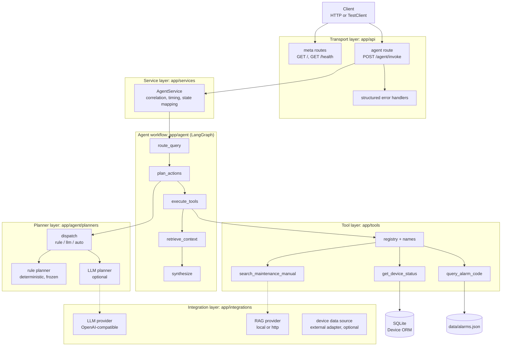
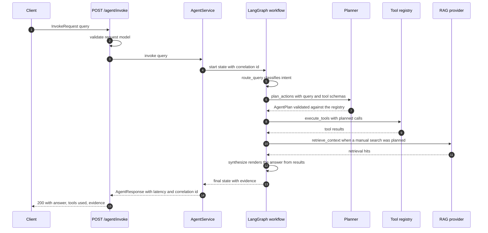
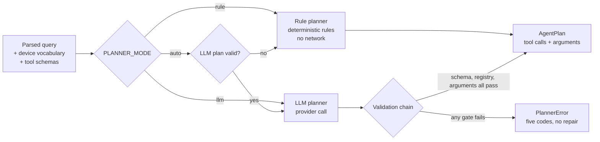
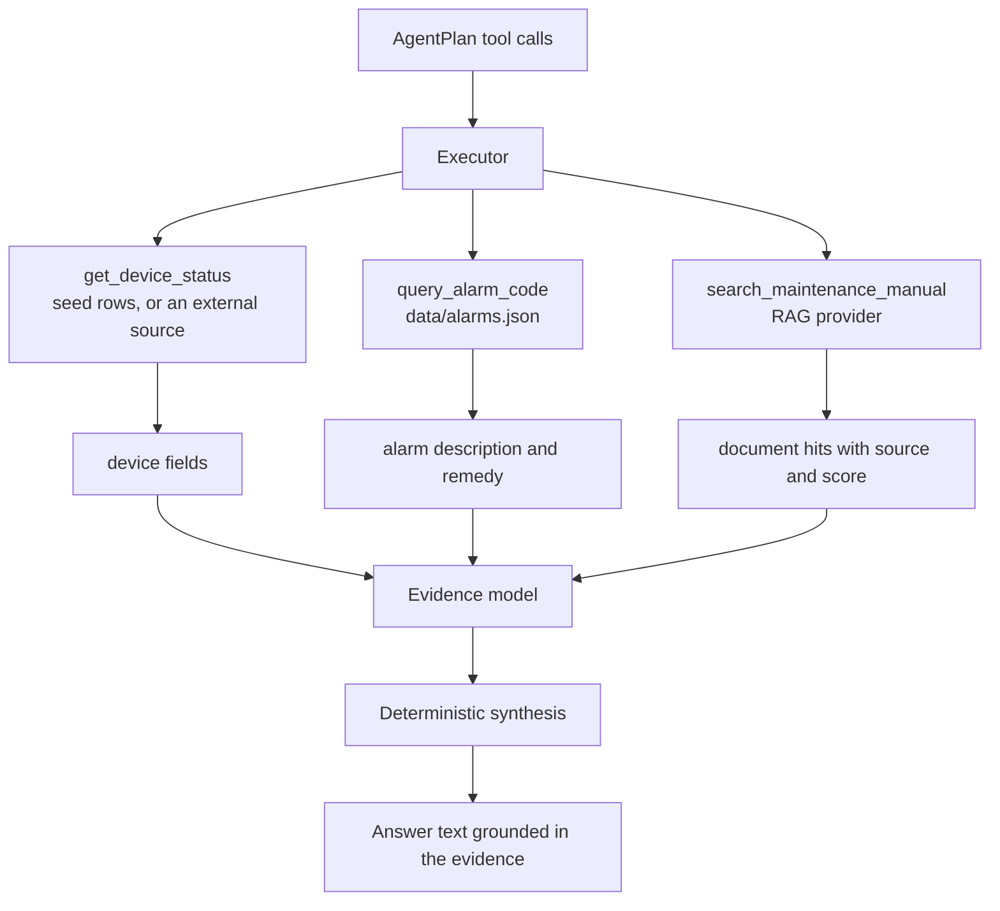
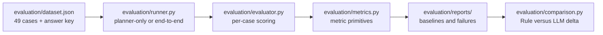

# Architecture

This document describes how a request travels through the Industrial Maintenance
Agent, which component owns each decision, and where the LLM is allowed to act.
It is the reference behind the summary in the README.

## 1. Purpose and boundaries

The service answers maintenance questions about registered industrial equipment
and returns an answer plus the evidence it was built from. Two properties define
the design.

The first is that the answer is assembled deterministically. The synthesis step
renders text from tool results and retrieval hits. It never asks a model to write
prose about equipment, because prose cannot be audited and a hallucinated torque
value is worse than no answer.

The second is that the LLM, when it is enabled at all, is confined to the
planning step. It chooses which tools to call and with which arguments. It does
not execute tools, does not see retrieval results when it plans, and does not
compose the final answer. With `PLANNER_MODE=rule` there is no LLM in the process
at any stage.

## 2. Component map

Solid edges are always-present paths. Dotted edges are configured off by default:
the LLM provider requires `PLANNER_MODE=llm` or `auto` plus credentials, and the
RAG provider requires `RAG_PROVIDER` to be configured.

## 3. Request lifecycle

The path length is fixed at planning time. There is no re-planning loop, so a
plan that names an unavailable tool is reported as a failure rather than retried.

## 4. Planner layer

Both planners emit the same `AgentPlan` model and both are validated against the
same registry, so the executor cannot tell which planner produced the plan. That
equivalence is what makes the Rule versus LLM comparison meaningful.

The validation chain has four gates and five error codes:

| Gate | Failure code |
| ---- | ------------ |
| Text parses as a JSON object | `INVALID_PLANNER_OUTPUT` |
| Object matches `AgentPlan` | `INVALID_PLANNER_OUTPUT` |
| Every named tool exists | `UNKNOWN_TOOL` |
| Every argument set satisfies the tool input model | `TOOL_ARGUMENT_VALIDATION_FAILED` |
| Provider transport fails or times out | `LLM_PROVIDER_ERROR`, `LLM_TIMEOUT` |

## 5. Tools and evidence

Three deterministic tools are registered at import time. None of them calls an
LLM. `search_maintenance_manual` is the only tool with an optional external
dependency, and when the RAG provider cannot run it returns `found=false` with an
`error` rather than an empty result, so an unavailable knowledge base cannot be
mistaken for a knowledge base with no match.

`get_device_status` is answered by two sources selected on the identifier: the
seeded SQLite rows, which own every identifier they define, and any external
adapter configured for the process, which owns its own identifiers only. An
adapter that claims an identifier but cannot be read produces `found=false` with
an `error`, which keeps three outcomes apart: the device is unknown, the source is
broken, or the device was found. The tool contract, the registered name and the
planner are identical whichever source answers, and detection of the external
device is case-insensitive while the answer reports the source's own canonical
identifier.

## 6. Module boundaries

| Layer | Package | Owns | Must not |
| ----- | ------- | ---- | -------- |
| Transport | `app/api` | HTTP contract, validation, error shaping | contain workflow logic |
| Service | `app/services` | correlation, timing, state translation | construct the workflow graph |
| Workflow | `app/agent` | graph order, state model, rule parsing | build HTTP responses |
| Planner | `app/agent/planners` | plan construction and validation | execute tools |
| Tools | `app/tools` | tool behaviour and argument validation | call planners |
| Integrations | `app/integrations` | provider transports | decide which tool to call |
| Persistence | `app/database` | ORM models, schema creation, seeding | hold business rules |

The dependency direction is one way. `app/services/__init__.py` exports lazily to
break the only cycle that would otherwise form between the service and the agent
package.

## 7. Evaluation framework

The evaluation framework lives beside the application rather than inside
`tests/`, because the two answer different questions. A test asserts that the
code matches the specification. The framework measures whether the plan was the
right plan, against a hand-authored answer key.

A metric with a zero denominator is recorded as `null`. Reporting `0.0` or `1.0`
there would invent a measurement that was never taken, and the comparison step
refuses to approximate rather than fill the gap.

## 8. Deliberate non-goals

1. No re-planning from tool output. Planning is single-shot by design.
2. No LLM-authored prose. The answer is rendered from evidence.
3. No authentication on `/agent/invoke`. The service is a localhost development
   surface until an auth layer is added.
4. No caching in the retrieval path. The reported latency states the real cost.
